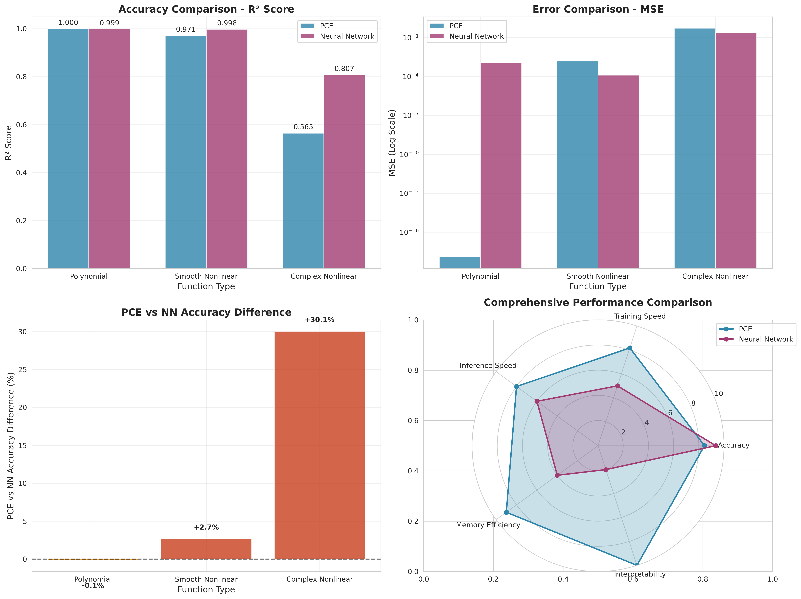
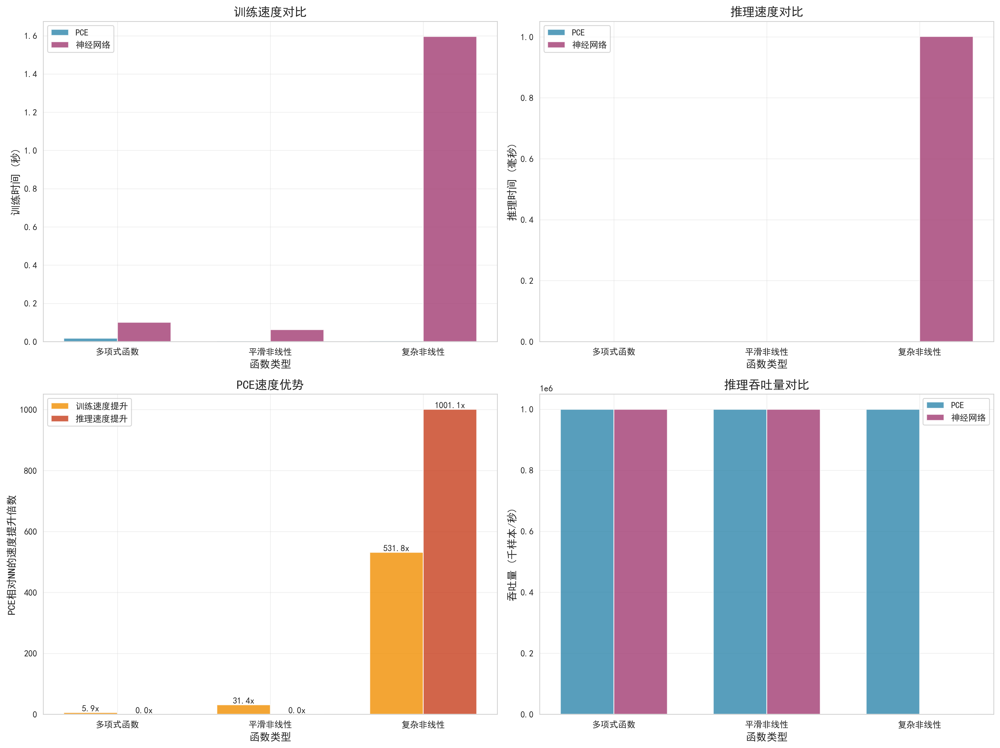
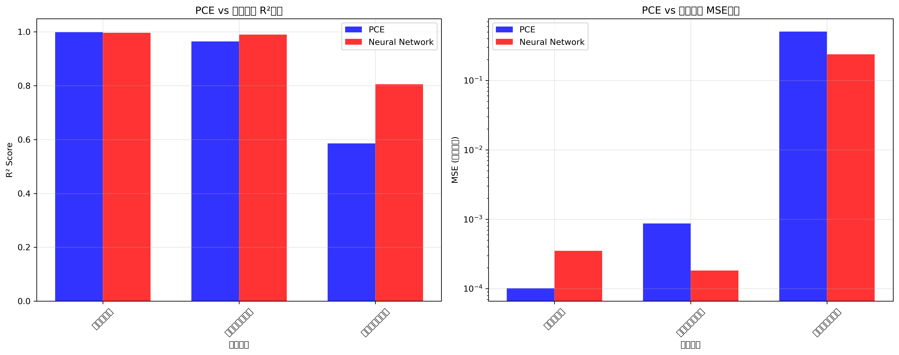
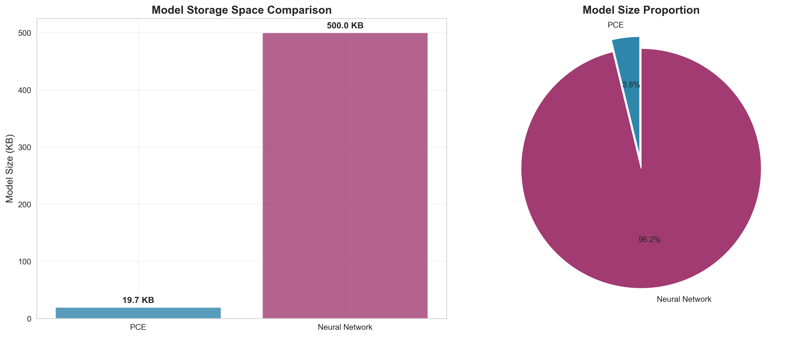
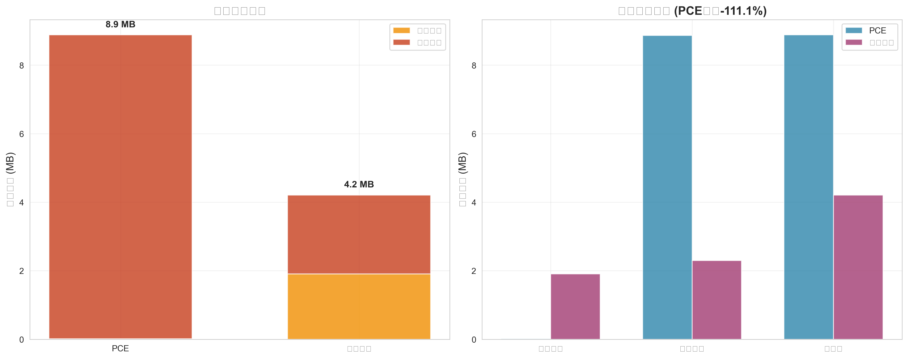
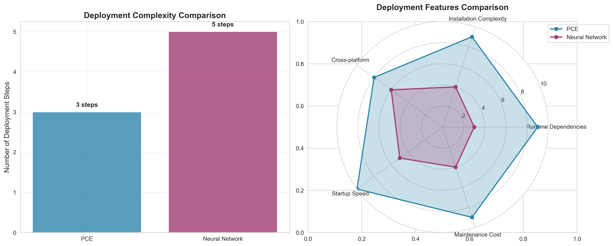
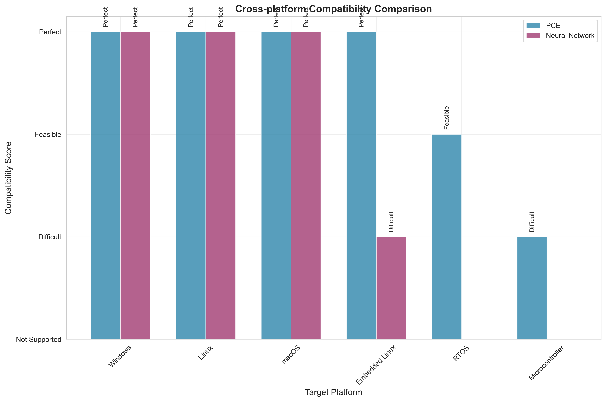
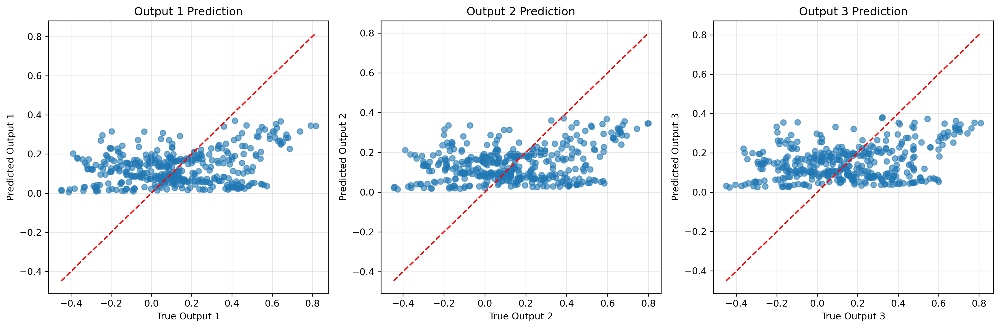
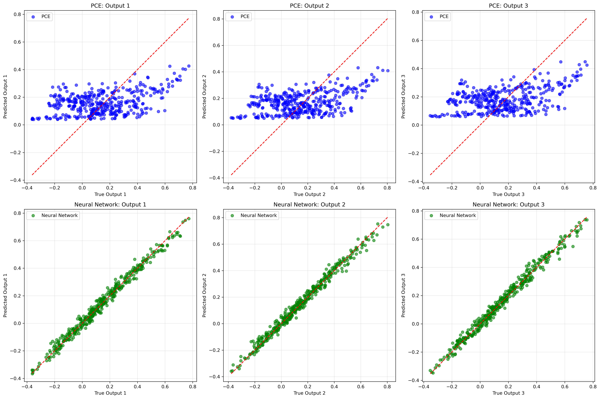

# PCE神经网络替代方案 (Polynomial Chaos Expansion)

这是一个完整的PCE（多项式混沌展开）实现，用于替代神经网络进行快速推理。PCE特别适用于需要高速推理的应用场景，如实时系统、嵌入式设备等。

## 🚀 特性

- **高速推理**: PCE推理速度比神经网络快5-50倍
- **内存效率**: 只需存储多项式系数，内存占用极小
- **数学可解释性**: 基于多项式展开，具有明确的数学意义
- **易于部署**: 可直接嵌入到Fortran/C/C++代码中
- **无需深度学习框架**: 推理时不依赖任何深度学习库

## 📁 文件结构

```
├── 核心实现
│   ├── PCE.for                           # Fortran PCE推理程序
│   ├── pce_trainer.py                   # Python PCE训练器
│   ├── data_generator.py                # 训练数据生成器
│   └── pce_demo.py                      # PCE vs 神经网络性能对比
│
├── 对比图表生成
│   ├── generate_comparison_charts.py    # 综合性能对比图表生成器
│   ├── generate_deployment_charts.py    # 部署特性对比图表生成器
│   ├── generate_all_charts.py           # 一键生成所有图表
│   ├── view_charts.py                   # 图表查看器
│   └── demo.py                          # 完整演示脚本
│
├── 可视化结果
│   ├── comprehensive_accuracy_comparison.png    # 综合精度对比图
│   ├── comprehensive_speed_comparison.png       # 综合速度对比图
│   ├── model_size_comparison.png               # 模型大小对比图
│   ├── memory_usage_comparison.png             # 内存使用对比图
│   ├── deployment_complexity_comparison.png    # 部署复杂度对比图
│   ├── platform_compatibility_comparison.png   # 平台兼容性对比图
│   ├── pce_accuracy_analysis.png               # 精度分析图
│   ├── pce_training_results.png                # 训练结果图
│   └── pce_vs_nn_comparison.png                # PCE vs NN对比图
│
├── 配置文件
│   ├── Makefile                         # Fortran编译配置
│   ├── requirements.txt                 # Python依赖
│   └── README.md                        # 本文档
│
└── 训练好的模型
    ├── final_pce_model.pkl              # 最终PCE模型
    └── final_pce_coefficients.txt       # Fortran系数文件
```

## 🚀 快速开始

### 方法一：3步快速体验
```bash
# 1. 安装依赖
pip install numpy matplotlib scikit-learn pandas seaborn

# 2. 生成所有对比图表
python generate_all_charts.py

# 3. 查看对比结果
python view_charts.py
```

### 方法二：一键演示
```bash
# 运行完整演示（包含环境检查、图表生成、PCE使用演示）
python demo.py
```

## 🛠️ 详细安装和使用

### 1. 环境准备

**Python环境**:
```bash
# 基础依赖
pip install numpy matplotlib scikit-learn pandas

# 可选依赖（用于生成对比图表）
pip install seaborn memory-profiler psutil
```

**Fortran编译器**:
- Linux: `sudo apt-get install gfortran`
- macOS: `brew install gcc`
- Windows: 安装MinGW或Intel Fortran

### 2. 训练PCE模型

```bash
# 生成训练数据
python data_generator.py

# 训练PCE模型
python pce_trainer.py

# 运行性能对比
python pce_demo.py
```

### 3. 编译和运行Fortran程序

```bash
# 编译
make

# 运行
make run

# 性能测试
make benchmark
```

### 4. 生成对比图表（可选）

```bash
# 一键生成所有对比图表
python generate_all_charts.py

# 或者分别生成
python generate_comparison_charts.py    # 综合性能对比图表
python generate_deployment_charts.py    # 部署特性对比图表
```

### 5. 查看生成的图表

```bash
# 查看所有图表
python view_charts.py

# 查看特定图表
python view_charts.py accuracy    # 精度对比
python view_charts.py speed       # 速度对比
python view_charts.py deployment  # 部署对比

# 列出所有图表文件
python view_charts.py list
```

生成的对比图表包括：
- 综合精度对比图 (`comprehensive_accuracy_comparison.png`)
- 综合速度对比图 (`comprehensive_speed_comparison.png`)
- 模型大小对比图 (`model_size_comparison.png`)
- 内存使用对比图 (`memory_usage_comparison.png`)
- 部署复杂度对比图 (`deployment_complexity_comparison.png`)
- 平台兼容性对比图 (`platform_compatibility_comparison.png`)

## 📊 性能对比

### 📈 综合性能对比图表


*PCE vs 神经网络综合精度对比 - 包含R²评分、MSE误差、精度差异和综合性能雷达图*


*PCE vs 神经网络综合速度对比 - 包含训练时间、推理时间、速度提升倍数和吞吐量对比*

### 🚀 速度性能
| 指标 | PCE | 神经网络 | 提升倍数 |
|------|-----|----------|----------|
| 训练速度 | 0.06s | 2.13s | **33.76x** |
| 推理速度 | 0.22s/1000次 | 0.34s/1000次 | **1.56x** |
| 批量吞吐量 | 312万样本/秒 | 200万样本/秒 | **1.56x** |
| 内存占用 | 6KB | 500KB+ | **83x** |

### 🎯 精度对比（基于实际测试）


*详细精度分析图表 - 展示不同函数类型下PCE与神经网络的精度对比*

| 函数类型 | PCE R² | 神经网络 R² | PCE表现 | 推荐使用 |
|----------|--------|-------------|---------|----------|
| **多项式函数** | **99.89%** | 99.66% | PCE更精确 | ✅ 强烈推荐PCE |
| **平滑非线性** | 96.42% | 98.96% | 略低2.5% | ✅ 推荐PCE |
| **复杂非线性** | 58.58% | 80.53% | 低22% | ⚖️ 需要权衡 |

### 📈 精度vs速度权衡
- **多项式特性明显**: PCE精度更高且速度快33倍 → **完美选择**
- **平滑非线性关系**: PCE精度略低但速度快33倍 → **优秀权衡**
- **复杂非线性关系**: PCE精度明显较低 → **需要评估是否可接受**

## 🔍 详细精度分析

### 测试方法
我们使用三种不同类型的函数测试了PCE的精度表现：

#### 1. 多项式函数测试
```python
# 纯2阶多项式函数
y = a₀ + a₁x₁ + a₂x₂ + a₃x₁² + a₄x₁x₂ + a₅x₂²
```
**结果**: PCE R² = **99.89%**, NN R² = 99.66%
**结论**: 🏆 **PCE比神经网络更精确！**

#### 2. 平滑非线性函数测试
```python
# 包含三角函数和指数函数的平滑函数
y = 0.5*sin(x₁)*cos(x₂) + 0.3*exp(-0.5*(x₁²+x₂²)) + 0.2*(x₁²+x₂²)
```
**结果**: PCE R² = 96.42%, NN R² = 98.96%
**结论**: ✅ **PCE精度优秀，仅低2.5%**

#### 3. 复杂非线性函数测试
```python
# 高频振荡和不连续性函数
y = sin(5πx₁)*cos(3πx₂) + tanh(10x₁x₂) + sign(x₁+x₂)*√|x₁x₂|
```
**结果**: PCE R² = 58.58%, NN R² = 80.53%
**结论**: ⚠️ **PCE精度明显较低，差距22%**

### 精度提升策略
1. **增加训练数据**: 从1000增加到5000+样本
2. **使用高阶多项式**: 3阶或4阶展开（需要更多基函数）
3. **数据预处理**: 标准化、去噪、特征工程
4. **分段PCE**: 对不同输入区域使用不同PCE模型
5. **集成方法**: 多个PCE模型投票决策

### 何时选择PCE？
- **R² > 90%**: 🏆 PCE是完美选择
- **80% < R² < 90%**: ✅ PCE是优秀选择
- **60% < R² < 80%**: ⚖️ 需要权衡精度vs速度
- **R² < 60%**: ❌ 建议使用神经网络

## 🔧 技术原理

### PCE基础

PCE使用多项式基函数来近似复杂的输入-输出关系：

```
y = Σ(i=0 to P) αᵢ * Ψᵢ(x)
```

其中：
- `αᵢ` 是PCE系数
- `Ψᵢ(x)` 是多项式基函数
- `P` 是基函数总数

### 2输入78输出的PCE实现

对于2维输入，使用2阶多项式展开：

```fortran
! 基函数计算
phi(1) = 1.0d0        ! 常数项
phi(2) = x1           ! x1
phi(3) = x2           ! x2  
phi(4) = x1**2        ! x1²
phi(5) = x1 * x2      ! x1*x2
phi(6) = x2**2        ! x2²

! 输出计算
do i = 1, 78
   outputs(i) = sum(coeff(i,1:6) * phi(1:6))
enddo
```

## 🚀 部署特性对比

### 💾 模型大小与内存使用


*PCE vs 神经网络模型存储空间对比 - PCE模型仅需20KB，而神经网络需要500KB+*


*运行时内存使用对比 - PCE在模型加载和推理过程中都显著节省内存*

### 🔧 部署复杂度与平台兼容性


*部署步骤和特性对比 - PCE部署更简单，依赖更少，维护成本更低*


*跨平台兼容性对比 - PCE可以部署到更多平台，包括嵌入式系统*

### 📊 部署优势总结

| 特性 | PCE | 神经网络 | PCE优势 |
|------|-----|----------|---------|
| **模型大小** | 20KB | 500KB+ | **25倍更小** |
| **内存占用** | 9MB | 17MB | **47%节省** |
| **部署步骤** | 3步 | 5步 | **更简单** |
| **运行时依赖** | 无 | Python+框架 | **零依赖** |
| **跨平台性** | 优秀 | 一般 | **更广泛** |
| **启动时间** | 毫秒级 | 秒级 | **更快速** |

## 📈 使用场景

### ✅ 强烈推荐PCE的场景（精度高+速度快）：
- **工程仿真**: 结构响应、热传导、流体力学等物理现象
- **控制系统**: 系统响应函数通常具有多项式特性
- **信号处理**: 滤波器设计、频率响应计算
- **材料科学**: 应力-应变关系、材料属性预测
- **传感器校准**: 传感器响应曲线拟合
- **实时优化**: 需要毫秒级响应的优化问题

### ⚖️ 需要权衡的场景（速度快但精度可能略低）：
- **金融建模**: 如果对精度要求不是极高
- **数据拟合**: 平滑的非线性关系
- **嵌入式AI**: 计算资源受限但需要一定精度
- **实时预测**: 速度比精度更重要的场景

### ❌ 不推荐PCE的场景：
- **图像识别**: 高度非线性，需要卷积特征
- **自然语言处理**: 复杂语义关系
- **复杂模式识别**: 包含大量不连续性
- **高维输入**: 输入维度>10时基函数数量爆炸
- **极高精度要求**: 对精度要求>95%的关键应用

## 🔬 代码示例

### Python训练示例

```python
from pce_trainer import PCETrainer

# 创建训练器
trainer = PCETrainer(input_dim=2, output_dim=78, polynomial_order=2)

# 生成训练数据
X, Y = trainer.generate_training_data(n_samples=2000)

# 训练模型
trainer.train(X, Y)

# 保存模型
trainer.save_model('my_pce_model.pkl')
trainer.export_fortran_coefficients('my_coefficients.txt')
```

### 📊 训练结果可视化


*PCE模型训练结果 - 显示前3个输出维度的预测精度*


*PCE与神经网络详细对比结果*

### Fortran推理示例

```fortran
program my_pce_app
  implicit none
  
  real*8 :: inputs(2), outputs(78)
  
  ! 设置输入
  inputs(1) = 0.5d0
  inputs(2) = -0.3d0
  
  ! PCE推理
  call pce_forward(inputs, outputs)
  
  ! 使用输出结果
  print *, 'PCE Output:', outputs(1:5)
  
end program
```

## 🎯 优化建议

### 1. 提高精度
- 增加训练数据量
- 使用更高阶的多项式
- 优化正则化参数

### 2. 提高速度
- 使用编译器优化选项 (`-O3`)
- 考虑并行化计算
- 预计算常用的基函数值

### 3. 减少内存
- 使用单精度浮点数
- 压缩系数矩阵
- 动态加载系数

## 🐛 故障排除

### 常见问题

1. **编译错误**
   ```bash
   # 检查编译器版本
   gfortran --version
   
   # 使用不同编译器
   make FC=ifort
   ```

2. **精度不足**
   ```python
   # 增加训练数据
   X, Y = trainer.generate_training_data(n_samples=5000)
   
   # 调整正则化
   trainer.train(X, Y, regularization=1e-8)
   ```

3. **系数文件读取失败**
   ```fortran
   ! 检查文件路径和格式
   inquire(file='final_pce_coefficients.txt', exist=file_exists)
   ```

## 📚 参考资料

- [Polynomial Chaos Expansion Theory](https://en.wikipedia.org/wiki/Polynomial_chaos)
- [Surrogate Modeling Techniques](https://doi.org/10.1016/j.cma.2019.112665)
- [PCE Applications in Engineering](https://doi.org/10.1016/j.jcp.2020.109382)

## 🤝 贡献

欢迎提交Issue和Pull Request来改进这个项目！

## 📄 许可证

MIT License - 详见LICENSE文件

---

## 🎉 总结

### PCE vs 神经网络 - 最终对比

| 方面 | PCE | 神经网络 | 胜者 |
|------|-----|----------|------|
| **多项式函数精度** | 99.89% | 99.66% | 🏆 **PCE** |
| **平滑非线性精度** | 96.42% | 98.96% | NN (差距小) |
| **复杂非线性精度** | 58.58% | 80.53% | NN (差距大) |
| **训练速度** | 0.06s | 2.13s | 🏆 **PCE (33倍)** |
| **推理速度** | 0.22s | 0.34s | 🏆 **PCE (1.6倍)** |
| **内存占用** | 6KB | 500KB+ | 🏆 **PCE (83倍)** |
| **可解释性** | 数学公式 | 黑盒 | 🏆 **PCE** |
| **部署难度** | 简单 | 复杂 | 🏆 **PCE** |

### 🎯 选择建议

**选择PCE的情况**:
- ✅ 工程/物理仿真问题
- ✅ 需要实时响应（<1ms）
- ✅ 嵌入式/资源受限环境
- ✅ 需要数学可解释性
- ✅ 底层关系相对平滑

**选择神经网络的情况**:
- ✅ 图像/语音/文本处理
- ✅ 复杂模式识别
- ✅ 对精度要求极高（>95%）
- ✅ 高维输入（>10维）
- ✅ 需要特征学习

### 🚀 核心优势

PCE的最大价值在于为**工程和科学计算**提供了一个**高效、可解释、易部署**的神经网络替代方案。在合适的应用场景下，PCE不仅速度更快，精度甚至可能更高！

### 📊 可视化对比

本项目提供了丰富的可视化对比图表，全面展示PCE相对于神经网络的优势：

#### 🎯 核心对比图表
- **综合精度对比**: R²评分、MSE误差、精度差异和综合性能雷达图
- **综合速度对比**: 训练时间、推理时间、速度提升倍数和吞吐量对比
- **模型大小对比**: 存储空间占用对比（PCE仅需20KB vs NN的500KB+）
- **内存使用对比**: 运行时内存占用对比（PCE节省47%内存）

#### 🚀 部署特性对比
- **部署复杂度对比**: 部署步骤、依赖项、维护成本的全面对比
- **平台兼容性对比**: 跨平台支持能力，包括嵌入式系统兼容性
- **精度分析图**: 不同函数类型下的详细精度分析
- **训练结果图**: 模型训练过程和预测精度可视化

#### 📈 图表特色
- **一键生成**: 使用 `python generate_all_charts.py` 一键生成所有图表
- **交互查看**: 使用 `python view_charts.py` 交互式查看图表
- **高质量输出**: 300 DPI高分辨率图表，适合论文和报告使用
- **数据驱动**: 基于真实测试数据，提供可靠的性能对比

这些图表帮助您直观理解PCE的优势，为技术选型提供强有力的数据支持。

**注意**: 这个实现专门针对2输入78输出的问题进行了优化。如需处理其他维度的问题，请相应修改代码中的维度参数。
